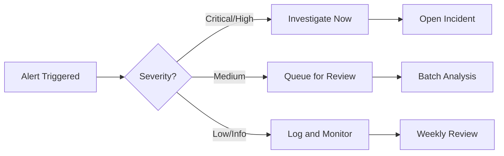

# Logan Security Dashboard - Quick Reference Card

## Essential Navigation

| Page | Icon | Purpose | Keyboard Shortcut |
|------|------|---------|-------------------|
| Dashboard | 🏠 | Real-time security overview | `Alt+H` |
| Security Overview | 🛡️ | Comprehensive metrics | `Alt+S` |
| Log Sources | 🗄️ | Manage log collection | `Alt+L` |
| Query Builder | ✨ | Advanced log analysis | `Alt+Q` |
| Storage Analytics | 💾 | Storage monitoring | `Alt+D` |
| Threat Hunting | 🎯 | Threat investigation | `Alt+T` |

## Common OCI Query Patterns

### Authentication & Access
```sql
-- Failed logins
'Event Name' = 'UserLoginFailed' | stats count by 'User Name'

-- Successful root logins
'Event Name' = 'UserLogin' and 'User Name' = 'root'

-- MFA bypass attempts
'Event Name' = 'UserLogin' and 'MFA Used' = 'false'
```

### Resource Management
```sql
-- Resource deletions
'Event Name' contains 'Delete' | sort -Time

-- Resource creation outside hours
'Event Name' contains 'Create' and extract_hour(Time) not in (8..17)

-- Configuration changes
'Event Name' contains 'Update' and 'Resource Type' = 'Configuration'
```

### Security Events
```sql
-- Privilege escalations
'Event Name' contains 'RoleAssign' | stats count by 'Principal Name'

-- Security group changes
'Resource Type' = 'SecurityList' and 'Event Name' contains 'Update'

-- Suspicious API calls
'Event Name' in ('GetUser', 'ListUsers', 'GetGroup') | stats count by 'Principal Name'
```

### Network Analysis
```sql
-- VCN flow logs by IP
'Log Source' = 'VCN Flow Logs' | stats sum(bytes) by 'Source IP'

-- Denied connections
'Action' = 'REJECT' | stats count by 'Source IP', 'Destination Port'

-- Unusual ports
'Destination Port' not in (80, 443, 22) | head 100
```

## Time Range Filters

| Syntax | Description | Example |
|--------|-------------|---------|
| `dateRelative(1h)` | Last 1 hour | `Time > dateRelative(1h)` |
| `dateRelative(24h)` | Last 24 hours | `Time > dateRelative(24h)` |
| `dateRelative(7d)` | Last 7 days | `Time > dateRelative(7d)` |
| `dateRelative(30d)` | Last 30 days | `Time > dateRelative(30d)` |

## Quick Actions

### From Dashboard
1. **View Active Threats**: Click threat count → Threat Analytics
2. **Check Compliance**: Click compliance % → Compliance Report
3. **System Health**: Hover over system status → View Details

### From Any Page
1. **Global Search**: `Ctrl/Cmd + K`
2. **New Query**: `Ctrl/Cmd + Q`
3. **Refresh Data**: `F5` or `Ctrl/Cmd + R`
4. **Toggle Theme**: `Ctrl/Cmd + D`

## Threat Severity Levels

| Level | Color | Response Time | Action Required |
|-------|-------|---------------|-----------------|
| Critical | 🔴 Red | Immediate | Incident response team |
| High | 🟠 Orange | < 1 hour | Security team |
| Medium | 🟡 Yellow | < 4 hours | Investigation |
| Low | 🟢 Green | < 24 hours | Monitor |
| Info | 🔵 Blue | As needed | Log only |

## Common Field Names

| Field | Description | Example Values |
|-------|-------------|----------------|
| `Time` | Event timestamp | `2025-01-19T10:30:00Z` |
| `Event Name` | Action performed | `UserLogin`, `CreateBucket` |
| `Principal Name` | Who did it | `john.doe@company.com` |
| `IP Address` | Source IP | `192.168.1.100` |
| `Resource Type` | What was affected | `Instance`, `Bucket`, `User` |
| `Compartment Name` | Where it happened | `Production`, `Development` |

## Alert Response Workflow



## Useful Operators

| Operator | Purpose | Example |
|----------|---------|---------|
| `contains` | Partial match | `'Event Name' contains 'Delete'` |
| `in` | Multiple values | `'User' in ('admin', 'root')` |
| `not` | Negation | `not 'Event Name' = 'ListUsers'` |
| `stats` | Aggregation | `stats count by 'User Name'` |
| `sort` | Order results | `sort -Time` (descending) |
| `head` | Limit results | `head 100` |

## Emergency Contacts

- **Security Incident**: security@company.com
- **On-Call**: +1-800-SEC-TEAM
- **Dashboard Support**: support@logan-security.com

---

**Print Tips**: Best printed in landscape mode, 2 pages per sheet

**Version**: 1.0 | **Updated**: January 2025