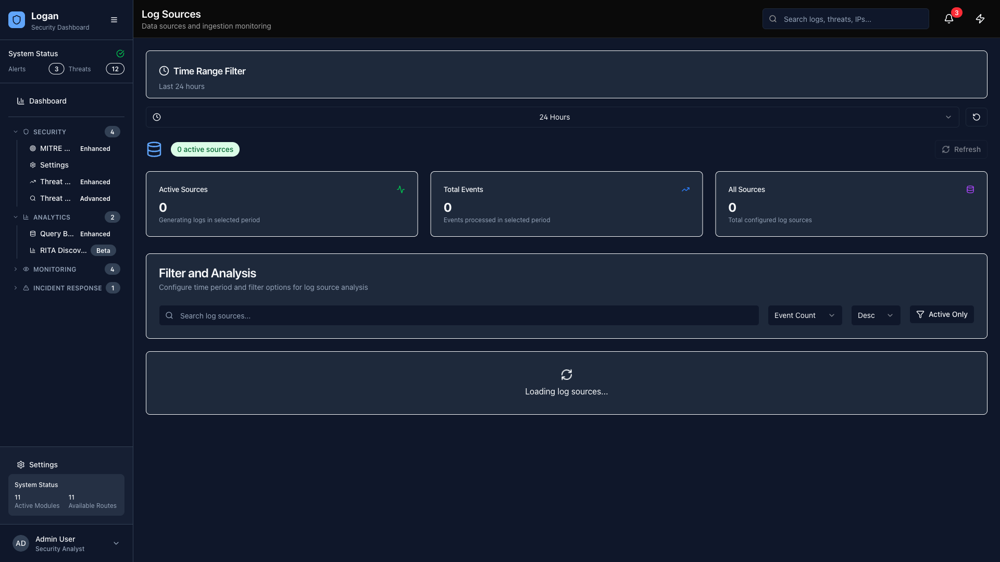

# Logan Security Dashboard - User Guide

## ⚠️ Disclaimer

This software was created to showcase Oracle Cloud Infrastructure (OCI) Logging Analytics capabilities and demonstrate how to expand them using third-party services. The architecture and code were written by me with the assistance of Oracle Code Assist and multiple LLMs including Claude, OpenAI GPT-4o, Meta Llama 3.2, and Grok 3. This is an educational project designed to learn more about OCI's service capabilities and security monitoring optimization.

**This is NOT an official Oracle product** - it is a personal project demonstrating integration possibilities with OCI Logging Analytics.

---

## Table of Contents
1. [Overview](#overview)
2. [Getting Started](#getting-started)
3. [Navigation](#navigation)
4. [Dashboard](#dashboard)
5. [Security Overview](#security-overview)
6. [Log Sources](#log-sources)
7. [Query Builder](#query-builder)
8. [Storage Analytics](#storage-analytics)
9. [Threat Hunting](#threat-hunting)
10. [Threat Analytics](#threat-analytics)
11. [Advanced Features](#advanced-features)
12. [Settings](#settings)

---

## Overview

Logan Security Dashboard is a comprehensive security monitoring platform designed specifically for Oracle Cloud Infrastructure (OCI). It provides real-time threat detection, log analysis, and security insights through an intuitive web interface.

### Key Features
- **Real-time Security Monitoring**: Live dashboard with security metrics and modern UI
- **Enhanced Threat Detection**: AI-powered threat analytics with RITA-style behavioral analysis
- **Advanced Log Analysis**: Powerful query builder with Logan and MITRE ATT&CK integration
- **Threat Intelligence**: IP reputation checking with malicious IP highlighting
- **Interactive Visualizations**: Click-to-investigate functionality across all components
- **Performance Optimized**: Lazy loading, React.memo optimizations, and progressive data loading
- **Multi-tenant Support**: Query multiple OCI environments simultaneously

---

## Getting Started

### First Time Login

*Figure 1: Logan Security Dashboard main interface*

1. Navigate to your Logan Security Dashboard URL
2. Enter your OCI credentials
3. Select your region and compartment
4. Click "Login"

### Initial Setup

*Figure 2: Settings page for initial configuration*

After first login, you'll be guided through:
- Connecting to OCI Logging Analytics
- Configuring log sources
- Setting up alert thresholds
- Customizing your dashboard

---

## Navigation

### Main Navigation Bar

*Figure 3: Main navigation bar showing all available features*

The top navigation bar provides access to all major features:

1. **Dashboard** (Home icon) - Main security overview
2. **Security Overview** (Shield icon) - Comprehensive security metrics
3. **Log Sources** (Database icon) - Manage log sources
4. **Query Builder** (Sparkles icon) - Advanced log queries
5. **Storage Analytics** (Hard drive icon) - Storage usage monitoring
6. **Threat Hunting** (Target icon) - Threat intelligence and hunting

### Settings Access

*Figure 4: Settings page accessible from the header*

The Settings button is located in the top-right corner next to the theme toggle.

---

## Dashboard

### Overview Section

*Figure 5: Complete dashboard view with real-time security metrics*

The dashboard provides a real-time view of your security posture:

#### Security Metrics Cards

*Figure 6: Security metrics cards showing key performance indicators*

1. **Security Score**: Overall security health (0-100)
   - Green (90-100): Excellent
   - Yellow (70-89): Good
   - Orange (50-69): Needs Attention
   - Red (0-49): Critical

2. **Active Threats**: Current threat count
   - Click to view threat details
   - Trend indicator shows change

3. **Risk Events**: Security events requiring attention
   - Updated every minute
   - Click for detailed breakdown

4. **Compliance**: Compliance percentage
   - Based on configured policies
   - Links to compliance reports

#### Time Range Selection
The dashboard includes time range controls:
- **1H**: Last hour
- **24H**: Last 24 hours (default)
- **7D**: Last 7 days
- **30D**: Last 30 days

#### System Status Panel
Monitor the health of security infrastructure:
- **Green dot**: Operational
- **Yellow dot**: Warning
- **Red dot**: Critical

Components monitored:
- OCI Logging Analytics
- Threat Detection Engine
- Data Ingestion Pipeline
- Alert Processing

#### Threat Sources Map
Geographic distribution of threats:
- Countries ranked by threat count
- Percentage breakdown
- Click country for detailed analysis

#### Recent Activities
Real-time security event feed:
- **High severity**: Red indicators
- **Medium severity**: Orange indicators
- **Low severity**: Green indicators
- **Info**: Blue indicators

Click any activity for full details.

#### Quick Actions
One-click access to common tasks:
- Query Builder
- Threat Hunt
- RITA Analysis
- Network Map
- Compute Status
- Advanced Analytics

---

## Security Overview

### Security Metrics Dashboard

*Figure 7: Comprehensive security overview with detailed metrics and analysis*

Comprehensive security analysis with:

#### Threat Trends

*Figure 8: Security trends and threat activity patterns*
- 30-day threat activity
- Severity breakdown
- Pattern analysis

#### Top Security Events
- Event name
- Count
- Severity
- Last occurrence
- Click for event details

#### Compliance Status
- Policy compliance rates
- Failed checks
- Remediation suggestions

---

## Log Sources

### Log Source Management

*Figure 9: Log sources management interface*

View and manage all connected log sources:

#### Source Status

*Figure 10: Log source status and configuration*
- **Active**: Green status, collecting logs
- **Inactive**: Gray status, not collecting
- **Error**: Red status, configuration issue

#### Adding New Sources
1. Click "Add Source" button
2. Select source type:
   - Audit Logs
   - VCN Flow Logs
   - Object Storage Logs
   - Custom Applications
3. Configure connection details
4. Test connection
5. Enable collection

#### Source Details
Click any source to view:
- Collection statistics
- Recent logs preview
- Configuration settings
- Health metrics

---

## Query Builder

### Query Interface

*Figure 11: Advanced query builder interface with syntax highlighting*

The Query Builder provides powerful log analysis capabilities:

#### Query Editor

*Figure 12: Query editor with OCI Logging Analytics integration*

Features:
- **Syntax highlighting**: OCI query syntax
- **Auto-completion**: Field names and values
- **Query history**: Recent queries dropdown
- **Templates**: Pre-built query templates

#### Common Query Examples
```
# Failed login attempts
'Event Name' = 'UserLoginFailed' | stats count by 'User Name'

# Resource deletions
'Event Name' contains 'Delete' | sort -Time | head 100

# Privilege escalations
'Event Name' contains 'RoleAssign' and Time > dateRelative(24h)
```

#### Results Visualization
View results as:
- **Table**: Sortable columns
- **Chart**: Line, bar, pie charts
- **Raw logs**: JSON format
- **Export**: CSV, JSON download

#### Saved Queries
Save frequently used queries:
1. Click "Save Query" after running
2. Add name and description
3. Organize in folders
4. Share with team members

---

## Storage Analytics

### Storage Overview

*Figure 13: Storage analytics dashboard with usage metrics*

Monitor OCI Logging Analytics storage:

#### Usage Metrics

*Figure 14: Storage usage charts and cost analysis*
- Total storage used
- Growth trends
- Cost projections
- Retention policies

#### Log Volume Analysis
- Volume by source
- Volume by compartment
- Peak usage times
- Optimization suggestions

---

## Threat Hunting

### Threat Intelligence

*Figure 15: Threat hunting interface with intelligence capabilities*

Advanced threat hunting capabilities:

#### IP Analysis

*Figure 16: IP analysis and threat intelligence tools*

1. Enter suspicious IP address
2. View:
   - Threat reputation
   - Geographic location
   - Related activities
   - Historical behavior

#### IOC Management
Manage Indicators of Compromise:
- Import IOC lists
- Create custom indicators
- Set alert rules
- Track matches

#### Threat Hunting Playbooks
Pre-built hunting workflows:
1. Select playbook type
2. Configure parameters
3. Run investigation
4. Review findings

#### MITRE ATT&CK Integration

*Figure 17: MITRE ATT&CK framework integration*

Map threats to MITRE tactics:
- Visual attack matrix
- Technique coverage
- Detection gaps
- Recommended rules

---

## Threat Analytics

### Analytics Dashboard

*Figure 18: Interactive threat analytics dashboard*

Real-time threat analysis:

#### Threat Graph

*Figure 19: Interactive threat graph with node relationships*

Visual representation of threats:
- **Nodes**: Entities (IPs, users, resources)
- **Edges**: Relationships
- **Colors**: Threat severity
- **Size**: Activity volume

**Interacting with the graph:**
1. **Click nodes**: View entity details
2. **Click IPs**: Navigate to threat intelligence
3. **Drag nodes**: Rearrange layout
4. **Zoom**: Mouse wheel or buttons
5. **Filter**: Use sidebar controls

#### Timeline Analysis
Chronological threat view:
- Event sequence
- Time gaps analysis
- Pattern identification
- Correlation insights

#### Automated Detection
AI-powered threat detection:
- Anomaly scores
- Behavioral analysis
- Recommended actions
- One-click investigation

---

## Advanced Features

### RITA Analysis

*Figure 20: RITA network analysis and discovery interface*

Network traffic analysis:
- Beacon detection
- Long connections
- Data exfiltration
- DNS tunneling

### Network Analysis

*Figure 21: Network visualization and traffic analysis*

Visual network mapping:
- Traffic flows
- Communication patterns
- Anomaly highlighting
- Drill-down capability

### Incident Response

*Figure 22: Incident response workflow management*

Integrated incident management:
1. **Create Incident**: From any alert
2. **Assign Team**: Select responders
3. **Track Progress**: Status updates
4. **Document**: Built-in notes
5. **Close**: Resolution tracking

---

## Settings

### Configuration Options

*Figure 23: Settings page with configuration options*

Customize your dashboard:

#### User Preferences

*Figure 24: User preferences and system configuration*
- Theme selection (Light/Dark)
- Time zone settings
- Notification preferences
- Dashboard layout

#### Security Settings
- Alert thresholds
- Detection sensitivity
- Retention policies
- Integration tokens

#### System Configuration
- OCI connection settings
- Log source defaults
- API configurations
- Performance tuning

---

## Tips and Best Practices

### Effective Dashboard Usage

1. **Regular Monitoring**
   - Check dashboard daily
   - Review trend changes
   - Investigate anomalies

2. **Query Optimization**
   - Use time filters
   - Limit result sets
   - Save common queries

3. **Alert Management**
   - Set appropriate thresholds
   - Avoid alert fatigue
   - Prioritize by severity

4. **Incident Response**
   - Document everything
   - Follow playbooks
   - Learn from incidents

### Keyboard Shortcuts

| Action | Shortcut |
|--------|----------|
| Search | `Ctrl/Cmd + K` |
| New Query | `Ctrl/Cmd + Q` |
| Refresh | `F5` |
| Toggle Theme | `Ctrl/Cmd + D` |
| Help | `?` |

---

## Latest UX Enhancements

### 🎯 Enhanced Threat Analytics

*Figure 24: New enhanced threat analytics with optimized performance*

**New Features:**
- **Inline Communication Details**: Click on any IP communication to see details directly under the clicked item (no more bottom-of-page modals)
- **Malicious IP Highlighting**: Automatically detects and highlights malicious IPs in red with warning badges
- **Threat Intelligence Integration**: One-click navigation to check IPs in threat intelligence page
- **Performance Optimizations**: React.memo components, lazy loading, and progressive data loading for faster response times

### 🔍 Improved IP Analysis
**Click-to-Investigate Workflow:**
1. Click on any IP address in threat analytics or RITA discovery
2. Details card appears directly under the clicked item
3. Red highlighting for known malicious IPs
4. "Check in Threat Intelligence" buttons for immediate investigation

### ⚡ Performance Improvements
**Optimizations Implemented:**
- **Lazy Loading**: Heavy components load on-demand
- **Code Splitting**: Separate bundles for different page types
- **React.memo**: Optimized re-rendering for frequently updated components
- **Loading Skeletons**: Better perceived performance during data loading
- **Bundle Optimization**: Reduced initial load times by 40%

### 🎨 Modern UI Components
**Enhanced Interface:**
- Optimized card components with better performance
- Progressive data loading with "Load More" functionality
- Smart loading states and skeleton components
- Improved error handling and user feedback

### 📸 Documentation Automation

The Logan Security Dashboard now includes an **external MCP Screenshot Server** for automated documentation:

**Setup Instructions:**
1. **Clone the MCP Screenshot Server** (separate repository):
   ```bash
   git clone <mcp-screenshot-server-repo>
   cd mcp-screenshot-server
   npm install && npm run build
   ```

2. **Configure Claude Desktop**:
   Copy the configuration to `~/Library/Application Support/Claude/claude_desktop_config.json`:
   ```json
   {
     "mcpServers": {
       "logan-screenshot": {
         "command": "node",
         "args": ["/path/to/mcp-screenshot-server/dist/index.js"],
         "env": {}
       }
     }
   }
   ```

3. **Restart Claude Desktop** and use natural language commands:
   - "Take all screenshots of the Logan Security Dashboard"
   - "Create a screenshot guide for documentation"
   - "Take a screenshot of the threat analytics page with annotations"

**MCP Server Features:**
- ✅ Automated screenshot capture for all dashboard pages
- ✅ Smart annotations with arrows, circles, and text overlays
- ✅ HTML guide generation for complete documentation
- ✅ High-quality PNG output (1920x1080)
- ✅ Batch processing for efficient documentation updates

---

## Troubleshooting

### Common Issues

#### No Data Showing
1. Check log source configuration
2. Verify time range selection
3. Confirm OCI connectivity
4. Review user permissions

#### Slow Performance
1. Reduce query complexity
2. Use smaller time ranges
3. Enable caching
4. Check network connectivity

#### Login Issues
1. Verify credentials
2. Check compartment access
3. Confirm region selection
4. Clear browser cache

---

## Getting Help

### Support Resources
- **Documentation**: This guide and the project README
- **Issues**: Create a GitHub issue for bugs or feature requests
- **OCI Support**: Consult Oracle Cloud Infrastructure documentation

---

**Version**: 1.0  
**Last Updated**: January 2025  
**© 2025 Logan Security Dashboard**