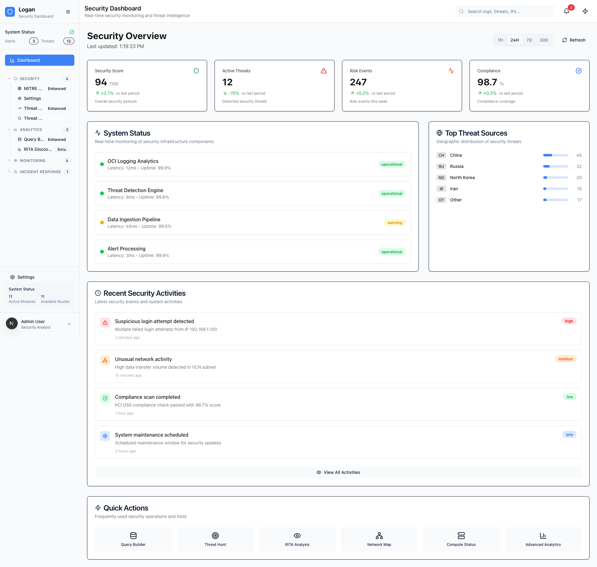
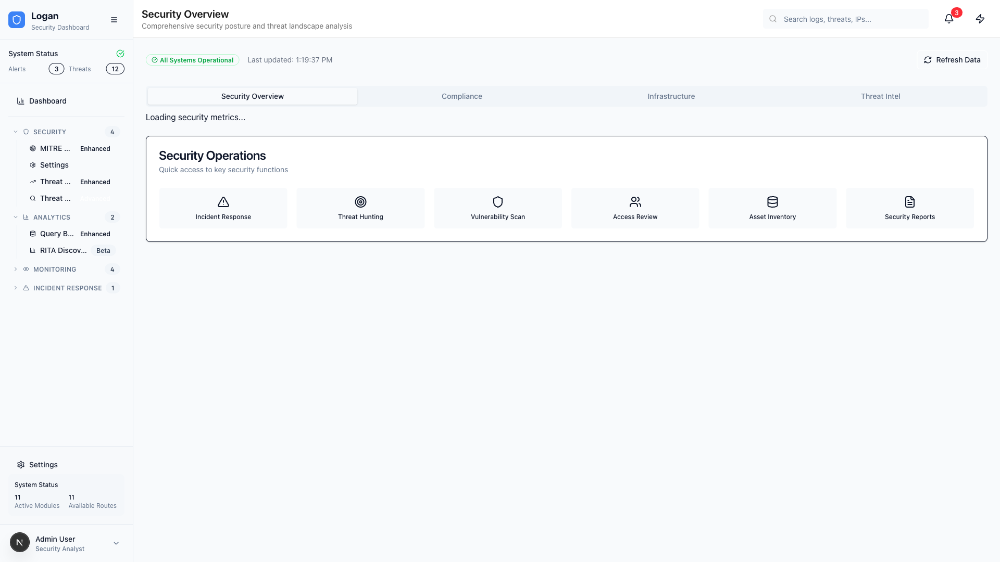
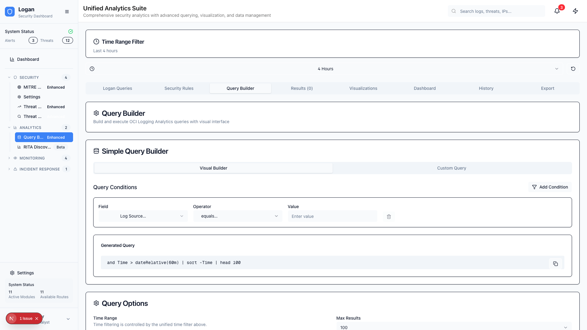
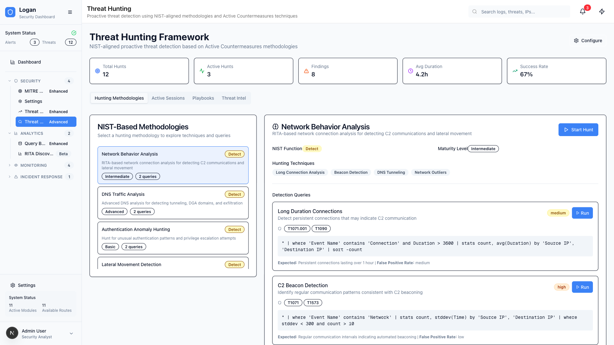
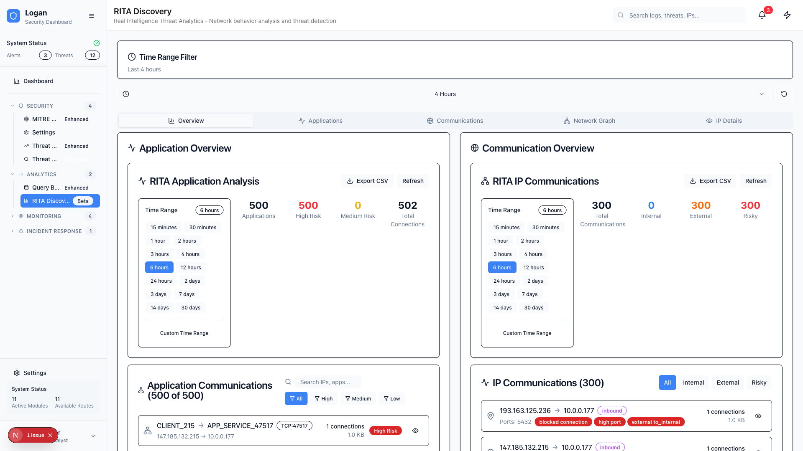
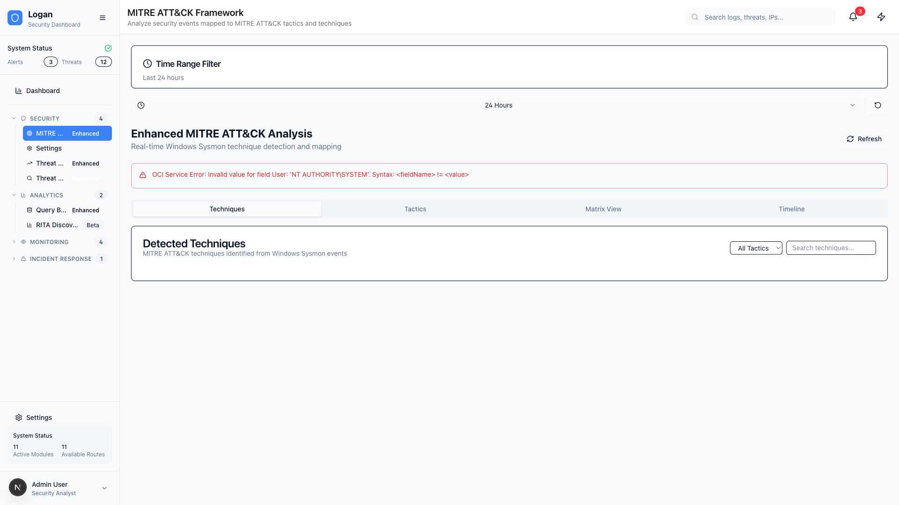

# Logan Security Dashboard - Visual Guide

This visual guide provides a comprehensive overview of the Logan Security Dashboard interface, showcasing key features and capabilities through actual screenshots of the application.

## 🏠 Dashboard Overview

The main dashboard serves as the central hub for security operations, providing:

- **Real-time Security Metrics**: Live security score indicators and threat levels
- **Security Event Summary**: Quick overview of failed logins, privilege escalations, and critical alerts
- **System Health Status**: Infrastructure component health monitoring
- **Quick Access Tools**: Direct navigation to key security features
- **Time-based Filtering**: Configurable time periods for analysis

### Key Features Highlighted:
- 🎯 Security score with visual indicators
- 📊 Event counters with trend analysis
- 🚨 System status dashboard
- 🔍 Quick search functionality

## 🛡️ Security Overview

The Security Overview page provides comprehensive security analytics:

- **Compliance Monitoring**: Real-time compliance status tracking
- **Threat Assessment**: Advanced threat level calculations
- **Security Trends**: Historical security event analysis
- **Risk Indicators**: Priority-based risk assessment
- **Infrastructure Health**: Detailed system component monitoring

### Key Components:
- 📈 Security metrics dashboard
- 🎯 Compliance indicators
- 🚨 Threat level assessments
- 📊 Historical trend analysis

## 🔍 Advanced Query Builder

The Advanced Query Builder empowers security analysts with:

- **OCI Logging Analytics Integration**: Direct query execution against OCI infrastructure
- **Syntax Highlighting**: Enhanced query writing experience
- **Auto-completion**: Field and function suggestions
- **Query Validation**: Real-time syntax checking
- **Saved Queries**: Query library management
- **Multiple Visualizations**: Charts, tables, and graphs

### Query Features:
- 💻 Advanced code editor with syntax highlighting
- 🔍 Field discovery and exploration
- 📚 Query library with saved templates
- 📊 Multiple visualization options
- ✅ Real-time validation and error checking

## 🎯 Threat Hunting

Comprehensive threat investigation tools include:

- **IP Analysis**: Deep dive into IP address activities
- **IOC Management**: Indicators of Compromise tracking
- **Threat Intelligence**: External threat data integration
- **Investigation Playbooks**: Structured investigation workflows
- **Evidence Collection**: Automated evidence gathering

### Hunting Capabilities:
- 🕵️ Advanced IP investigation tools
- 📋 IOC management interface
- 🌐 Threat intelligence integration
- 📖 Investigation playbooks
- 🔗 Cross-reference analysis

## 🕸️ RITA Network Discovery

Network behavior analysis using RITA-style algorithms:

- **Communication Pattern Detection**: Identify unusual network communications
- **Beacon Analysis**: Detect command and control communications
- **Long Connection Analysis**: Monitor persistent connections
- **Application Discovery**: Network application identification
- **Timeline Analysis**: Time-based communication patterns

### Network Analysis Features:
- 📡 Communication pattern visualization
- 🎯 Beacon detection algorithms
- ⏱️ Long connection monitoring
- 🔍 Application behavior analysis
- 📈 Timeline-based investigation

## 🎯 MITRE ATT&CK Integration

Framework-based threat categorization and analysis:

- **Technique Mapping**: Map security events to MITRE ATT&CK techniques
- **Heat Maps**: Visual representation of threat coverage
- **Layer Generation**: Custom ATT&CK layer creation
- **Sysmon Integration**: Windows event log analysis
- **Threat Coverage**: Assessment of detection capabilities

### MITRE Features:
- 🗺️ Interactive ATT&CK matrix
- 🎨 Heat map visualizations
- 📊 Coverage analysis
- 🔗 Technique correlation
- 📋 Custom layer management

## 🔧 Navigation and User Experience

### Unified Interface Design
All pages share a consistent navigation structure:
- **Top Navigation**: Quick access to main features
- **Sidebar Navigation**: Detailed feature organization
- **Time Controls**: Unified time filtering across all components
- **Search Integration**: Global search capabilities
- **Responsive Design**: Optimized for different screen sizes

### Common UI Elements
- 🎨 Modern, dark-themed interface
- 📱 Mobile-responsive design
- ⚡ Fast, interactive components
- 🔍 Integrated search functionality
- 📊 Consistent chart and visualization styles

## 🚀 Getting Started

### Navigation Flow
1. **Start at Dashboard**: Get overview of security posture
2. **Security Overview**: Dive deeper into security metrics
3. **Query Builder**: Investigate specific security events
4. **Threat Hunting**: Conduct detailed investigations
5. **RITA Discovery**: Analyze network behaviors
6. **MITRE ATT&CK**: Understand threat techniques

### Best Practices
- Use time filters to focus analysis on relevant periods
- Leverage saved queries for repeated investigations
- Combine multiple tools for comprehensive threat analysis
- Monitor dashboard regularly for security updates
- Utilize threat intelligence for context enrichment

## 📊 Screenshot Information

All screenshots were captured using the Logan MCP Screenshot Server:
- **Resolution**: 1920x1080 for optimal clarity
- **Browser**: Headless Chrome/Chromium
- **Viewport**: Standardized for consistency
- **Timing**: Captured with appropriate wait times for dynamic content
- **Quality**: Full page captures where appropriate

## 🔗 Related Documentation

- [Installation Guide](./README.md#installation)
- [Configuration Guide](./configuration/guide.md)
- [API Reference](./api/reference.md)
- [Troubleshooting](./troubleshooting/common-issues.md)
- [Architecture Overview](./architecture/overview.md)

---

*Last updated: December 2024*  
*Screenshots generated with Logan MCP Screenshot Server*