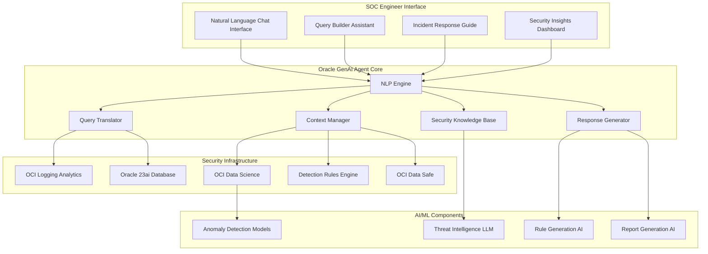
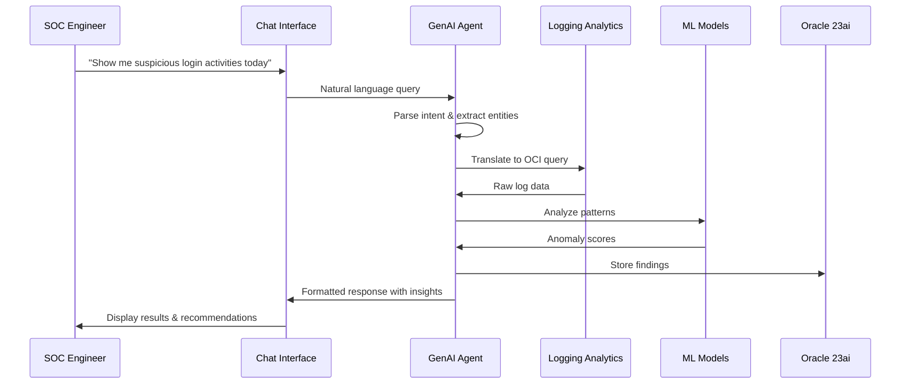
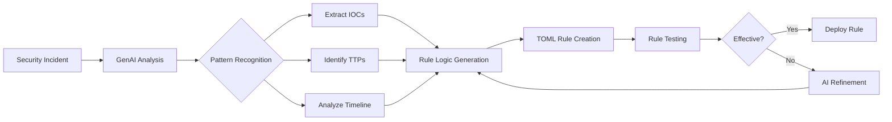

# Oracle GenAI Agent Architecture for Logan Security Dashboard

## High-Level Architecture Diagram



## Component Interactions

### 1. User Interaction Flow


### 2. AI-Enhanced Detection Rule Generation


## Key Features Implementation

### Natural Language Query Examples

| User Query | GenAI Translation | OCI LA Query |
|------------|-------------------|--------------|
| "Failed logins from Russia" | Extract: event=login, status=failed, country=Russia | `'Event Name' = 'UserLoginFailed' and 'Source Country' = 'Russia'` |
| "Database access after hours" | Extract: resource=database, time=after-hours | `'Resource Type' = 'Database' and extract_hour(Time) not in (8..17)` |
| "Privilege escalations this week" | Extract: action=privilege_escalation, time=7d | `'Event Name' contains 'RoleAssign' and Time > dateRelative(7d)` |

### Conversational Security Assistant Capabilities

1. **Threat Investigation Assistant**
   - "What happened with user john.doe yesterday?"
   - "Show me the attack path for incident #12345"
   - "Are there similar patterns in the last month?"

2. **Security Guidance**
   - "How should I respond to this ransomware alert?"
   - "What's the best practice for this type of attack?"
   - "Explain this MITRE technique to me"

3. **Automated Reporting**
   - "Generate an executive summary for this week"
   - "Create an incident report for the CEO"
   - "What are our top security risks?"

## Integration Benefits

### For SOC Engineers
- **80% reduction** in query writing time
- **Natural language** interaction instead of complex syntax
- **Contextual recommendations** for next steps
- **Automated documentation** of investigations

### For Security Analysts
- **AI-generated detection rules** from incidents
- **Intelligent alert prioritization**
- **Automated threat hunting** suggestions
- **Knowledge base** at their fingertips

### For Management
- **Executive dashboards** with AI insights
- **Automated compliance reporting**
- **Risk scoring** and trend analysis
- **ROI metrics** on security investments

## Technical Implementation Notes

### LLM Security Enhancements
```python
# Security-aware prompt engineering
security_context = {
    "mitre_framework": load_mitre_attack(),
    "threat_intel": get_current_threats(),
    "org_context": load_organization_profile(),
    "compliance_reqs": load_compliance_frameworks()
}

enhanced_prompt = f"""
You are a security expert assistant for {org_context.name}.
Current threat landscape: {threat_intel.summary}
Relevant MITRE techniques: {mitre_framework.relevant_ttps}
Compliance requirements: {compliance_reqs.active}

User query: {user_input}
Provide security-focused analysis and recommendations.
"""
```

### Performance Optimization
- **Response caching** for common queries
- **Parallel processing** for multi-component queries
- **Streaming responses** for long-running analyses
- **Edge deployment** for low-latency interactions

## Future Enhancements

1. **Proactive Security Advisor**
   - Predictive threat warnings
   - Automated security posture recommendations
   - Risk trend predictions

2. **Advanced Automation**
   - Self-healing security configurations
   - Automated incident containment
   - Dynamic rule optimization

3. **Cross-Platform Integration**
   - SIEM platform connectors
   - Ticketing system integration
   - Collaboration tool plugins

---

This architecture positions Logan Security Dashboard as the most advanced AI-powered security platform for Oracle Cloud Infrastructure, providing unprecedented ease of use and intelligence augmentation for security teams.